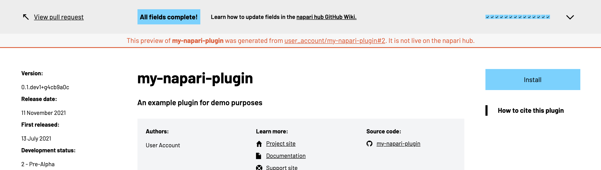

# Setting up PR plugin previews

If you'd like to know what your napari hub plugin page will look like after making
some changes, you can use our plugin preview service to get an updated preview
page every time you open a new pull request, or update an existing one.

## Setting it up

### 1. Install the GitHub app
First, you will need to install the napari Hub Plugin Preview GitHub app to the account or
organization where the plugin lives. 
Follow [this link](https://github.com/apps/napari-hub-plugin-preview) and click the green `Install` button on the right.


Select the account or organization where the plugin repository is hosted.


Finally, choose to install to "Only select repositories" by clicking on the text and selecting
the plugin repository from the dropdown menu. If you have multiple plugins, you can select
them all. Note that you'll still need to add the workflow to each repository individually,
[as below](#set-up-the-github-workflow). Once you've selected your repository, click `Install` in the bottom left.


### 2. Set up the GitHub workflow
Now that we've got the GitHub app installed, we need to add a workflow to your repository
that can listen out for your Pull Requests and trigger our GitHub action. The GitHub action
will build the preview page, and the GitHub app will let you know when it's ready.

To add the workflow to your plugin repository, copy the YAML snippet below into a new YAML file
e.g. `plugin_preview.yml` and place this file in a `.github/workflows` folder at the root of your repository.

```yaml
name: Preview Page

on:
  pull_request:
    branches:
      - '**'

jobs:
  preview-page:
    name: Preview Page Deploy
    runs-on: ubuntu-latest

    steps:
      - name: Checkout repo
        uses: actions/checkout@v2

      - name: napari hub Preview Page Builder
        uses: chanzuckerberg/napari-hub-preview-action@v0.1.4
        with:
          hub-ref: main
```

Commit this file and push it to your repository.
### 3. Open your pull request and view your preview
Now that your workflow and GitHub app are set up, you can open a Pull Request to your
plugin repo! This will kick off your preview workflow, and once the preview is built,
the app will post a comment to your pull request with a link to the preview page 
(it may take up to 5 minutes for this comment to be posted).
<!-- TODO: is 5 minutes accurate? -->


Updates to your pull request will automatically trigger a rebuild of your preview page.

## Using your preview page

If you click on the link posted by our GitHub app, you might see something that looks like this:


Each of the fields you can edit is listed in the banner at the top of the preview page. 
Blue fields mean you have provided this value, while orange fields mean you haven't provided it yet. 
You can click on each orange field to be taken to its location in your plugin page and open a tooltip highlighting what the field is for. 
The tooltip will also link you to our [Customizing your plugin listing](./customizing-plugin-listing) guide to find out how each field can be edited.


If you update your pull request to provide missing information, the relevant fields will be updated to blue - note you can use
the same URL to preview your latest changes, but it may take up to 5 minutes for the preview to be updated.
Your friendly GitHub bot will let you know once it's ready.

Once all your fields are complete, the banner will collapse and there will be no further highlights on your preview page.



```{note}
You may see a message at the top of the preview page telling you 
"This preview of <your-plugin> was generated from <some-other-account>/<your-plugin>, *but your metadata points to
<your-account>/<your-plugin> as the source code. Learn more."


Typically, this message would appear if you're working in a fork of the main repository and haven't edited the source
code URL to point to your own fork. In these cases you can likely disregard this message - once your changes are 
merged into the main repository, the napari hub will update accordingly. However, if you're planning to maintain
a "true fork" i.e. release the fork as a standalone plugin, you should probably update the source code URL.

This message may also occur if you've mistyped your source code URL, or if it points to a personal account instead
of the organization where your plugin is stored. In this case, you may also want to update the source code URL.

[This guide](./customizing-plugin-listing#code-repository) has information on how to set the source code URL of your plugin.
```

If you notice any issues with the metadata, or discrepancies in what the preview page is showing versus what 
you see on the napari hub, please let us know by raising an issue on the [napari hub repo](https://github.com/chanzuckerberg/napari-hub/issues/new/choose).

## How does it work?
One of the challenges of building this preview is that much of the metadata of your 
plugin is parsed from the PyPI JSON API. This means your metadata on the napari hub
won't be updated until your package is released - but you don't want to release your
plugin, realize you've made a typo, and have to cut a new release just to fix this
small error.

This plugin preview service therefore relies on building a wheel of your package after
checking out your repository, and parsing the wheel's metadata directly. Any of your 
metadata that comes from other sources (like your `config.yml` or `citation.cff` files)
is pulled directly from your GitHub repository.

<!-- TODO: is this all valid and do we need more detail? -->
Once the metadata is parsed, we use the [GitHub action](https://github.com/chanzuckerberg/napari-hub-preview-action) in a Pull Request triggered workflow to build your preview page.
The page built by your action is then rendered using the help of the [GitHub app](https://github.com/apps/napari-hub-plugin-preview), which
is also responsible for posting the URL of your preview page on your PR once it's ready.

<!-- TODO: what do we want the user to do if they want more information -->
For more information...?


