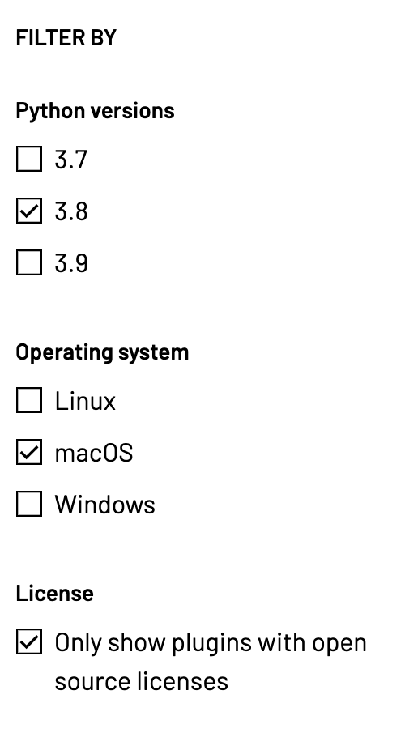
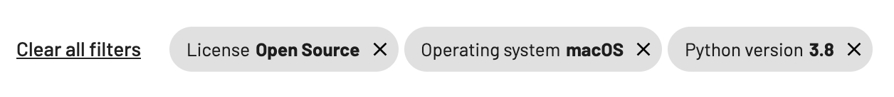
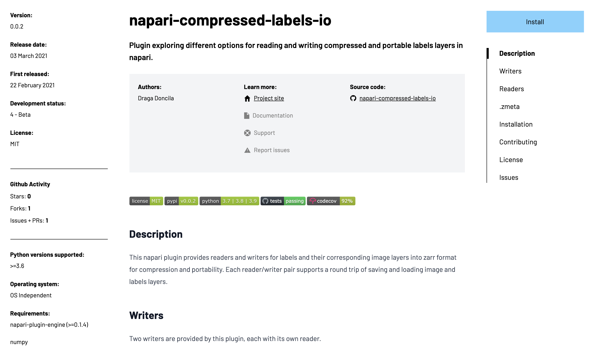

# Frontend Architecture

High-level documentation for the napari hub frontend architecture.

## Table of Contents

- [Table of Contents](#table-of-contents)
- [Components](#components)
  - [Composition](#composition)
  - [Types](#types)
  - [Styling](#styling)
  - [Material UI](#material-ui)
  - [Icons](#icons)
  - [Responsive Design](#responsive-design)
    - [Why Fresnel?](#why-fresnel)
    - [Breakpoints](#breakpoints)
- [State Management](#state-management)
  - [URL Parameters](#url-parameters)
  - [SPDX](#spdx)
  - [Plugin Data](#plugin-data)
  - [Plugin Search](#plugin-search)
    - [Searching](#searching)
      - [Creating the index](#creating-the-index)
      - [User Queries](#user-queries)
    - [Filtering](#filtering)
    - [Chips](#chips)
      - [Query Parameter Serialization](#query-parameter-serialization)
    - [Sorting](#sorting)
      - [Relevance](#relevance)
- [Pages](#pages)
  - [Plugin Page](#plugin-page)
    - [Markdown Rendering](#markdown-rendering)
    - [Dynamic TOC from Markdown](#dynamic-toc-from-markdown)
  - [Search Page](#search-page)
    - [Description Rendering](#description-rendering)
  - [Markdown Pages (FAQ, About, Privacy, etc.)](#markdown-pages-faq-about-privacy-etc)
    - [Dynamic TOC from HTML](#dynamic-toc-from-html)
- [Server Side Rendering](#server-side-rendering)
  - [Client vs. Server](#client-vs-server)
  - [SEO](#seo)
  - [Performance](#performance)

## Components

Conceptually, you can think of the frontend as a [function that takes in some
state and outputs some UI](https://reactjs.org/docs/components-and-props.html):

```ts
const S = { ... };
const UI = f(S)
```

`S` represents the current state of the application, `UI` is a description of
the what UI we want to render in the browser, and `f` is a function that returns
a description of what the UI should look like. That function is known as a
[component](https://reactjs.org/docs/components-and-props.html).

### Composition

> You can skip this section if you're familiar with [React](https://reactjs.org/).

Using [composition](https://reactjs.org/docs/composition-vs-inheritance.html),
it's possible to build entire applications as a single function. With this
model, we've built the napari hub as a composition of functional components,
making it easier to modularize and reuse code.

To better visualize the concept, you can think of the [landing page for napari
hub](https://www.napari-hub.org/) as the composition of multiple components:

```ts
const landingPage = LandingPage(
  AppBar(),
  PluginSearch(
    SearchBar(
      Input(),
    ),
    LeftColumn(
      SortForm(
        Input(),
      ),
      FilterForm(
        CheckboxUI(),
        CheckboxUI(),
        CheckboxUI(),
      ),
    ),
    SearchResults(
      SearchResult(),
      SearchResult(),
      ...,
    ),
  ),
);
```

### Types

All components (except for [pages](#pages)) are located in
[src/components](../src/components/)
and are usually implemented in one of the following ways:

| Type    | When to use it                                                                                                                                                                                                                                                                                                                                                                                                                                                                                                                                        | Examples                                                                                                                                                                                                                                                                            |
| ------- | ----------------------------------------------------------------------------------------------------------------------------------------------------------------------------------------------------------------------------------------------------------------------------------------------------------------------------------------------------------------------------------------------------------------------------------------------------------------------------------------------------------------------------------------------------- | ----------------------------------------------------------------------------------------------------------------------------------------------------------------------------------------------------------------------------------------------------------------------------------- |
| Feature | Used for a particular feature. These are stored directly in `src/components`.                                                                                                                                                                                                                                                                                                                                                                                                                                                                         | <ul><li>[AppBar](../src/components/AppBar/AppBar.tsx)</li> <li>[PluginSearch](../src/components/PluginSearch/PluginSearch.tsx)</li> <li>[SignupForm](../src/components/SignupForm/SignupForm.tsx)</li></ul>                                                                         |
| Common  | Components that are generic or used in several other components. These are stored in `src/components/common`.                                                                                                                                                                                                                                                                                                                                                                                                                                         | <ul><li>[Accordion](../src/components/common/Accordion/Accordion.tsx)</li> <li>[Link](../src/components/common/Link/Link.tsx)</li> <li>[TextHighlighter](../src/components/common/TextHighlighter/TextHighlighter.tsx)</li></ul>                                                    |
| Local   | Defined within the file for another component. This is useful for breaking down a large component into multiple smaller components.                                                                                                                                                                                                                                                                                                                                                                                                                   | <ul><li>[PluginCenterColumn](../src/components/PluginDetails/PluginDetails.tsx#L20-L82)</li> <li>[PluginGithubData](../src/components/PluginDetails/PluginMetadata.tsx#L22-L69)</li> <li>[CopyPluginNameButton](../src/components/PluginDetails/InstallModal.tsx#L21-L79)</li></ul> |
| Nested  | Implemented as sub-modules within the parent feature component's module directory. Similar to **Local Components**, this is useful for breaking down a large component into multiple smaller components. One way to determine if a component should be a **Local Component** or a **Nested Component** is to check the level of nesting. <br><br> If you break down a component into a local component, and you find yourself breaking down that local component into more local components, it might be better to move everything into its own file. | <ul><li>[MetadataList](../src/components/PluginDetails/MetadataList.tsx)</li> <li>[InstallModal](../src/components/PluginDetails/InstallModal.tsx)</li> <li>[PluginSearchContorls](../src/components/PluginSearch/PluginSearchControls.tsx)</li></ul>                               |

### Styling

Components can be styled in two ways:

| Type                                      | When to use it                                                                  | Example                                                                                     |
| ----------------------------------------- | ------------------------------------------------------------------------------- | ------------------------------------------------------------------------------------------- |
| [Tailwind](./tooling.md#tailwind)         | Prefer creating styles in Tailwind whenever possible to reduce CSS bundle size. | [TableOfContents.tsx](../src/components/common/TableOfContents/TableOfContents.tsx#L49-L70) |
| [SCSS Modules](./tooling.md#scss-modules) | Use when the full expressiveness of SCSS is required.                           | [SupportInfo.module.scss](../src/components/PluginDetails/SupportInfo.module.scss)          |

### Material UI

[Material UI](https://material-ui.com/) is a library that provides a a catalog
of components like buttons, tooltips, and dialogs. We use Material UI primarily
to reduce the amount of time required to build / maintain core components, so
that developers can focus on building features.

We also have plans to possibly migrate over to the [Science Design
System](https://github.com/chanzuckerberg/sci-components), since Material UI is
used as a base dependency.

### Icons

Icons are special components that return the SVG markup directly. Instead of
loading the icons using ``, we embed the SVG in a component so that we can
apply CSS to the SVG. This allows us to change things like the size, stroke, and
color directly.

Icons are located in
[src/components/common/icons](../src/components/common/icons),
and are all exported from
[icons/index.ts](../src/components/common/icons/index.ts).

### Responsive Design

The napari hub is a responsive website, and is accessible from a variety of
different screen sizes. We use a combination of [Tailwind's responsive design
variants](https://tailwindcss.com/docs/responsive-design) and
[Fresnel](https://github.com/artsy/fresnel).

Tailwind and Fresnel are both capable at making components responsive, but
deciding on which to use depends on the type of responsiveness required.

| Type     | When to use it                                                                                                                                                            | Examples                                                                                                                                                                                                                                                                |
| -------- | ------------------------------------------------------------------------------------------------------------------------------------------------------------------------- | ----------------------------------------------------------------------------------------------------------------------------------------------------------------------------------------------------------------------------------------------------------------------- |
| Tailwind | <ol><li>If a component's styles changes at different breakpoints. </li></ol>                                                                                              | <ol><li>[PluginSearchResult](../src/components/PluginSearch/PluginSearchResult.tsx#L138-L140)</li></ol>                                                                                                                                                                 |
| Fresnel  | <ol><li>If a component is rendered at specific breakpoints and hidden on others.</li> <li>If a component has receives different props at different breakpoints.</li></ol> | <ol><li>[PluginRightColumn](../src/components/PluginDetails/PluginDetails.tsx#L89-L106) </li> <li>[PluginMetadata](../src/components/PluginDetails/PluginMetadata.tsx#L187-L193) and [SupportInfo](../src/components/PluginDetails/SupportInfo.tsx#L143-L150)</li></ol> |

The
[MetadataList](../src/components/PluginDetails/MetadataList.tsx)
component is a good example for Fresnel's 2nd use case. It has the prop `inilne`
to render the list values as an inline list, and it's used in
[PluginMetadata](../src/components/PluginDetails/PluginMetadata.tsx#L187-L193)
and
[SupportInfo](../src/components/PluginDetails/SupportInfo.tsx#L143-L150).
The PluginMetadata component uses `inline` for displays <875px, while the the
SupportInfo component uses `inilne` for displays <1425px.

#### Why Fresnel?

The biggest reason for using Fresnel over other solutions is because of its
SSR-friendly approach for rendering breakpoints. Unlike other solutions,
[Fresnel doesn't conditionally render on
breakpoints](https://github.com/artsy/fresnel#why-not-conditionally-render).
Instead, it sends the HTML for all breakpoints and removes them after React
[hydrates](https://reactjs.org/docs/react-dom.html#hydrate) the client markup.

#### Breakpoints

Breakpoints are shared between Fresnel and Tailwind in the the
[src/theme.js](../src/theme.js#L18-L41)
module. The breakpoints are named using `screen-<size>` to improve readability and make it easier to add new breakpoints.

The naming scheme is not perfect, and we do have
[plans](https://github.com/chanzuckerberg/napari-hub/pull/49#issuecomment-844582584)
on finding ways to improve it.

## State Management

Client state is managed using [React
Context](https://reactjs.org/docs/context.html), allowing us to provide access
to state for an entire component tree.

### URL Parameters

**Files**: [src/condtext/urlParameters](../src/context/urlParameters)

The URL Parameters context provider maintains a dictionary of all query
parameters being used. Whenever the dictionary is updated, its serialized into a
URL search string (example: `?search=video&sort=pluginName`) and is added to the
browser URL.

We use the library
[use-query-params](https://github.com/pbeshai/use-query-params) for managing
query parameters, and the context provider is mainly a wrapper.

### SPDX

**Files**: [src/context/spdx](../frontend/src/context/spdx)

The SPDX context provider returns an API for checking if a SPDX license ID is
OSI approved. It accepts [SPDX license
data](https://github.com/spdx/license-list-data/blob/c7772f027c96228befd70686e494a6910270ccd1/json/licenses.json)
as input and uses the data to create a set of OSI approved licenses using the
`isOsiApproved` property.

This is used primarily by the open source licnese filter.

```ts
export interface SpdxAPI {
  isOSIApproved(licenseID: string): boolean;
}
```

### Plugin Data

**Files**: [src/context/plugin](../src/context/plugin.tsx)

The Plugin context provider is used for storing plugin and repo data in a
central data store. This allows easy access to the plugin and repo data from any
component in the provider subtree.

```ts
export interface PluginDataAPI {
  plugin: PluginData;
  repo: RepoData;
  repoFetchError: string;
}
```

### Plugin Search

**Files**: [src/context/search](../frontend/src/context/search)

The Plugin Search context provider implements functionality for searching,
sorting, and filtering plugin search results. This works by maintaining an
instance of the search engine index and [piping search results through filter
and sort
functions](../src/context/search/search.context.tsx#L30-L32).

The provider component returns an API for accessing search results and setting
form state for the search query, sort type, and filters:

```ts
export interface SearchAPI {
  results: SearchResult[];

  search: {
    query: string;
    setQuery(query: string): void;
    clearQuery(): void;
  };

  sort: {
    sortType: SortType;
    setSortType(sortType: SortType): void;
  };

  filter: {
    chips: string[];
    state: FilterFormState;

    clearAll(): void;
    removeChip(chip: string): void;
    setLicense(options: Record<string, boolean>): void;
    setOperatingSystem(options: Record<string, boolean>): void;
    setPythonVersion(options: Record<string, boolean>): void;
  };
}
```

#### Searching


Plugin search is handled entirely in the browser, using
[Fuse.js](https://fusejs.io/) for our search engine. The frontend fetches the
index data from the backend and uses it to create the Fuse.js index. This index
is then used for searching for plugins given a particular user query.

##### Creating the index

Creating the search engine index for querying is a multi-step process:

1. The user loads https://napari-hub.org.
1. The frontend server [fetches the plugin index](../src/pages/index.tsx#L59) from the hub backend.
1. The plugin index data is [server side rendered with the home page](../src/pages/index.tsx#L97-L99).
1. After React hydration, the the plugin index data is used to [create the
   search engine
   index](../src/context/search/search.hooks.ts#L32-L49).

##### User Queries

When a user submits a new query, it executes a query on the search engine, and
updates the search result state. This process for this looks like:

1. User enters query `video` and hits enter.
1. [Query state and parameter gets set](../src/context/search/search.hooks.ts#L109-L112)
1. [Change to query state is detected, and search result state gets updated](../src/context/search/search.hooks.ts#L70-L105)

#### Filtering



After searching, the plugins are then filtered based on the filter UI form
state. Each filter function is implemented as a hook with the following
signature:

```ts
declare function useFilterFunction(
  state: FilterFormState,
  results: SearchResult[],
): SearchResult[];
```

Each filter function is stored in an
[array](../src/context/search/filters.ts#L109-L114)
and [called
sequentially](../src/context/search/filters.ts#L128-L135)
using the result of the last execution for the input of the current function:

```ts
const FILTERS = [
  useFilterFunction1,
  useFilterFunction2,
  ...,
];
```

Implementing the filter functions this way makes it easier to extend the filter
functionality by implementing a new function and adding it to the array.

There are currently 3 filters in use right now:

1. [Filter by Python version](../src/context/search/filters.ts#L14-L35)
1. [Filter by operating system](../src/context/search/filters.ts#L43-L71)
1. [Filter by license](../src/context/search/filters.ts#L93-L104)

#### Chips



Chips is a reflection of the form state in another UI component, so internally
the state is a [read-only state that is derived from the form
state](../src/context/search/filter.hooks.ts#L72).
This makes it easier to keep the form state and chips in sync since we only have
to worry about updating one state instead of two.

##### Query Parameter Serialization

The form state is serialized using `JSON.stringify()` and encoded using
`encodeURIComponent()`. This is handled internally using the [JsonParam
type](https://github.com/pbeshai/use-query-params/tree/master/packages/serialize-query-params#param-types).

While this works, it returns an unreadable string:

```text
?filter=%7B"license"%3A%7B"onlyOpenSourcePlugins"%3Atrue...
```

We do have plans to implement a more human-readable serialization function.

#### Sorting


The sort form state is simply a [string
value](../src/context/search/sort.hooks.ts#L24-L31)
that can be changed to [one of four sort
types](../src/context/search/constants.ts#L9-L14).

##### Relevance

Relevance is an additional sort type that gets added when the user submitted a
search query. When the user submits a query, the [sort type switches over to
`Relevance`](../src/context/search/search.hooks.ts#L163-L197).

## Pages

[Pages](https://nextjs.org/docs/basic-features/pages) are entry points to
different parts of the website. They're implemented like [regular
components](#components), but the files are located in `src/pages` instead of
`src/components`.

Routing is handled entirely using [Next.js' file-system
routing](https://nextjs.org/docs/routing/introduction). This lets us add new
pages by creating a new file in `src/pages`. For example,
`src/pages/example.tsx` will create a route for `/example`.

### Plugin Page



**File**: [src/pages/plugin/[name].tsx](../src/pages/plugins/%5Bname%5D.tsx)

The plugin page [fetches plugin
data](../src/pages/plugins/%5Bname%5D.tsx#L126)
from the hub backend, and [repo
data](../src/pages/plugins/%5Bname%5D.tsx#L133)
from GitHub. The data is then used to server side render the [plugin
page](../src/components/PluginDetails/PluginDetails.tsx#L113-L121),
which includes the [plugin
metadata](../src/components/PluginDetails/PluginMetadata.tsx),
[Markdown
description](../src/components/PluginDetails/PluginDetails.tsx#L71-L73),
[TOC](../src/components/PluginDetails/PluginDetails.tsx#L94-L104),
and [install
button](../src/components/PluginDetails/PluginDetails.tsx#L41-L43).

#### Markdown Rendering

Markdown rendering for the plugin page is handled by the awesome
[react-markdown](https://github.com/remarkjs/react-markdown) library. We use
several
[remark](../src/components/common/Markdown/Markdown.tsx#L26-L34)
and
[rehype](../src/components/common/Markdown/Markdown.tsx#L36-L45)
plugins to make the rendering experience similar to GitHub.

It's also possible to include videos in Markdown using GitHub user content
links. Since [GitHub added videos to public
beta](https://github.blog/changelog/2020-12-16-video-upload-public-beta/), we
wanted to extend this functionality in the hub.

See [#77](https://github.com/chanzuckerberg/napari-hub/pull/77) for details.

#### Dynamic TOC from Markdown

The TOC is generated dynamically from the markdown. This works by [compiling the
Markdown to
AST](../src/components/common/Markdown/Markdown.utils.ts#L51-L54)
and [filtering for `<h2>`
tags](../src/components/common/Markdown/Markdown.utils.ts#L57-L62).

### Search Page

**File**: [src/pages/index.tsx](../src/pages/index.tsx)

The search page [fetches plugin index
data](../src/pages/index.tsx#L59)
from the hub backend and uses it for the client search engine. It renders the
[plugin search
page](../src/components/PluginSearch/PluginSearch.tsx#L12-L36),
which includes the [search
bar](../src/components/PluginSearch/PluginSearchBar.tsx#L10),
[filter and sort
forms](../src/components/PluginSearch/PluginSearchControls.tsx#L13),
and the [search result
list](../src/components/PluginSearch/PluginSearchResultList.tsx#L10).

#### Description Rendering

After fetching the the plugin index, the Markdown descriptions need to be
[rendered](../src/pages/index.tsx#L31-L52)
into its textual content for indexing. This is necessary because we don't want
to index on Markdown specific syntax or hidden alt-text.

### Markdown Pages (FAQ, About, Privacy, etc.)

**File**: `src/pages/*.mdx` (example: [src/pages/about.mdx](../src/pages/about.mdx))

Markdown pages are written using [MDX](https://mdxjs.com/) so that content
writers can write in plain Markdown and also take advantage of JSX syntax and
components.

This is especially useful for the FAQ page which uses the [Accordion
component](https://github.com/chanzuckerberg/napari-hub/blame/main/frontend/src/pages/faq.mdx#L34-L40)
extensively.

#### Dynamic TOC from HTML

Some of the Markdown pages include a TOC that is dynamically populated using the
headings in the HTML. This works differently from the plugin page because
instead of rendering the AST, it [renders the
headings](../src/utils/linkvars.js#L7-L31)
with an ID that is
[query-able](../src/components/LayoutMDX/LayoutMDX.hooks.ts#L10-L12).

We'll eventually consolidate these two approaches and refactor the Markdown TOC
to use the HTML heading IDs too.

## Server Side Rendering

Next.js provides the ability to [server side
render](https://nextjs.org/docs/basic-features/pages#server-side-rendering)
pages so that we can fetch data on the server and send HTML with the data
pre-populated in the response.

For the napari frontend, we use a hybrid approach of code running on the client
and code running on the server.

### Client vs. Server

[Universal JavaScript](https://en.wikipedia.org/wiki/Isomorphic_JavaScript) is JavaScript that runs on both the client and the server. With Next.js, it's a lot easier to write universal JavaScript.

Every component that we write is technically universal because it runs on the
server for SSR and it runs on the client after hydration, but there are
occasionally exceptions like the
[SyntaxHighlighter](../src/components/common/Markdown/MarkdownCode.tsx#L19-L38)
component which needs to be loaded only on the client side.

| Type   | Differences                                                                                                                                                                                                                                        |
| ------ | -------------------------------------------------------------------------------------------------------------------------------------------------------------------------------------------------------------------------------------------------- |
| Server | <ol><li>Can import Node.js modules like [os](https://nodejs.org/api/os.html)</li> <li>Can fetch data for SSR using [getServerSideProps()](https://nextjs.org/docs/basic-features/data-fetching#getserversideprops-server-side-rendering)</li></ol> |
| Client | <ol><li>Can use browser APIs like [Document.querySelector()](https://developer.mozilla.org/en-US/docs/Web/API/Document/querySelector)</li> <li>Can use [React effects](https://reactjs.org/docs/hooks-effect.html)</li></ol>                       |

### SEO

A big reason for using SSR is to improve SEO. While Google is improving
JavaScript execution for its Googlebot web crawler, it's still better to rely on
either
[pre-rendering](https://nextjs.org/docs/basic-features/pages#pre-rendering) via
SSR or static site generation.

This is because executing JavaScript pages is expensive. Googlebot has a [crawl
budget](https://www.botify.com/blog/from-crawl-budget-to-render-budget), and so
it has to queue pages for JavaScript execution. With that in mind, we have no
idea how long it'll take for content to get indexed.

### Performance

The performance impact of SSR can vary depending on how we use it. SSR can be
beneficial to us because users will see a page already filled with data, meaning
faster load time and less JavaScript execution on initial load. But if we're not
careful, it can significantly slow down the [Time To First Byte
(TTFB)](https://web.dev/time-to-first-byte/) if the data we're fetching takes
too long.

This is something we noticed prior to our initial release because a lot of time
was spent fetching data from the hub backend and rendering Markdown on the
server. This unfortunately slowed down the initial load for pages by a
noticeable amount of time, making the user experience sub-optimal.

With that in mind, a hybrid approach of SSR and CSR (Client Side Rendering) is
required to improve overall performance. Critical data that should be included
in the initial HTML should be rendered using SSR, while data that takes a long
time to fetch or extraneous data should be rendered using CSR.
